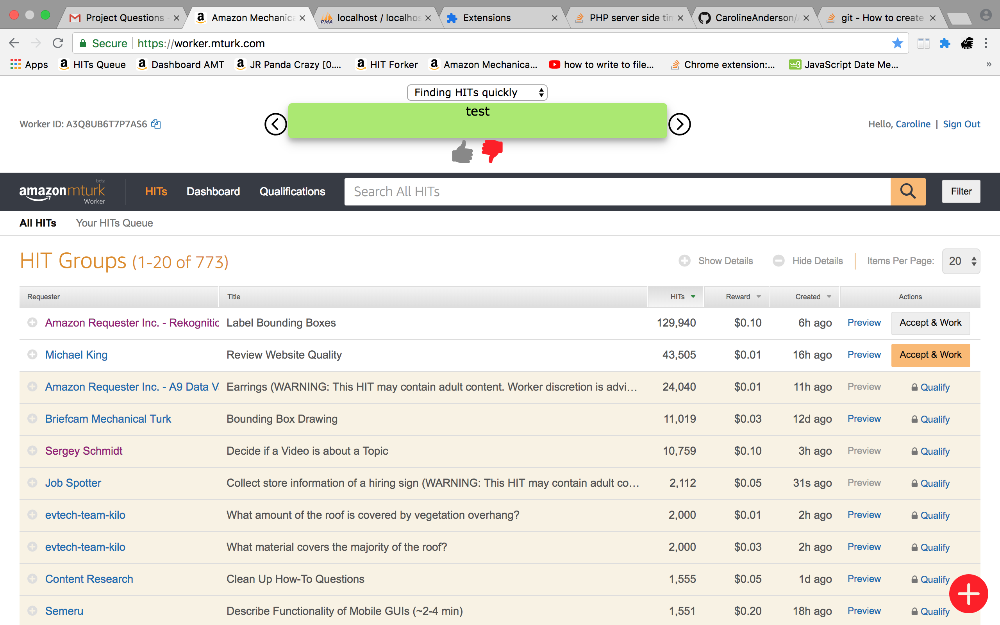

# AMTPlugIn
A plug in to display advice at https://worker.mturk.com/

---------------------------------------- extensionFiles --------------------------------------

The extension folder hold all of the files necessary for the chrome extension to operate. To download the extension, go to chrome://extensions/, 
click "load unpacked" and select extensionFiles.

--------------------------------------- phpFiles ---------------------------------------------
The phpFiles hold all the php code that is referenced in the extension so the advice that the user inputs into the extension is posted to the 
database and can be seen by all users.

I used xampp (https://www.apachefriends.org/download.html) for testing purposes. The apache web server and the mySQL database
must be running for the extension to operate. In the htdocs folder under XAMPP files, I created a folder called "saveAdvice" to hold all the php files necessary to store the extension's data. The extension file advicebox.js references this folder several times: "http:localhost/saveAdvice/nameOfFile". 

The name of the mySQL database is adviceStorage and the table name is hints. This is a description of the fields of the hint table:

| field  | type |
| ------------- | ------------- |
| id| int|
| adviceText | text |
| workerId | text |
| adviceType| text |
| upVotes| int|
| hidden| text|

If upVotes is greater than 10, then advicebox.js sets the hidden field to true and users can no longer see that piece of advice.

