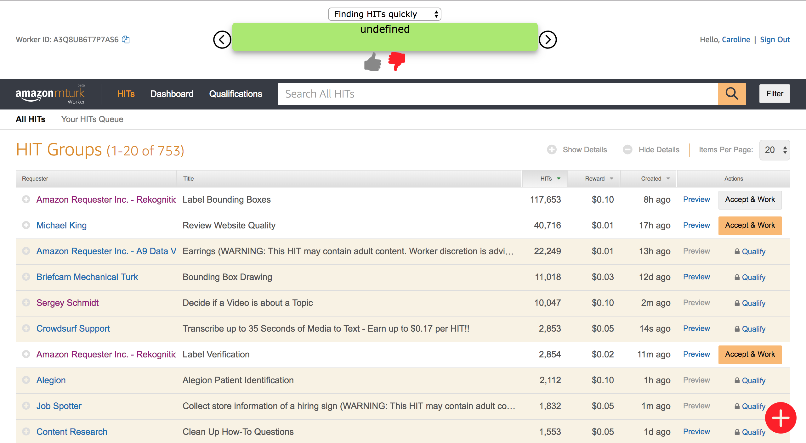

# AMTPlugIn
A plug in to display advice at https://worker.mturk.com/

---------------------------------------- extensionFiles --------------------------------------

The extension folder hold all of the files necessary for the chrome extension to operate. To download the extension, go to chrome://extensions/, 
click "load unpacked" and select extensionFiles.

--------------------------------------- phpFiles ---------------------------------------------

The phpFiles hold all the php code that is referenced in the extension so the advice that the user inputs into the extension is posted to the database and can be seen by all users.

I used xampp (https://www.apachefriends.org/download.html) for testing purposes. The apache web server and the mySQL database
must be running for the extension to operate. In the htdocs folder under XAMPP files, I created a folder called "saveAdvice" to hold all the php files necessary to store the extension's data. The extension file advicebox.js references this folder several times: "http:localhost/saveAdvice/nameOfFile". 

The name of the mySQL database is adviceStorage and the table name is hints. This is a description of the fields of the hint table:

| field  | type |
| ------------- | ------------- |
| id| int|
| adviceText | text |
| workerId | text |
| adviceType| text |
| upVotes| int|
| hidden| text|

---------------How to use----------------------

This is what the extension should look like when first downloaded. The green box reads undefined since there is nothing in the database. 

When you click on the red circle in the bottom right corner, a box should display that lets you add new hints. Use the selector to choose what kind of advice it is and click "Add Advice" to add this information to the database.

Once information has been added to the database, you can use the selector up top to see the hints based on their category. Use the right and left arrows to see different advice snippets.

Click the thumbs up if you like a piece of advice and click thumbs down if you do not like the piece of advice. If upVotes becomes -10 or lower, then users can no longer see this piece of advice.
